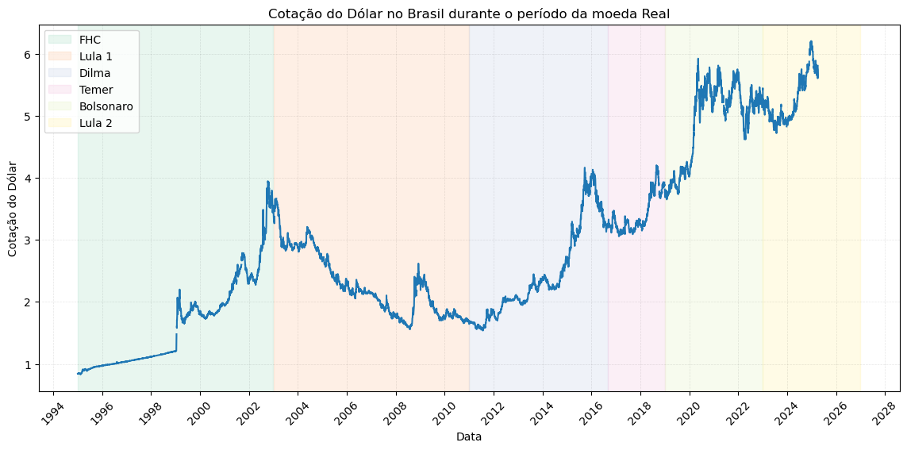

# Preço do Real em relação ao Dólar durante o mandato de cada Presidente.

Aqui faço uma busca do preço do real durante sua existência e segmento por cada mandato de cada presidente. 
Faço a utilização da API: FRED  API, para extração e tratamento dos dados.

## Consumindo APIs que precisam de keys

Fonte: https://fred.stlouisfed.org/

É necessário criar uma conta no site e gerar uma key. A key é um código que identifica o usuário e permite o acesso à API. Este é um cenário muito comum, pois muitas APIs são pagas e precisam de uma key para serem consumidas. Neste caso, a API é gratuita e a key é gerada automaticamente.

>  "This product uses the FRED® API but is not endorsed or certified by the Federal Reserve Bank of St. Louis."



## Organização do projeto

```
├── .gitignore         <- Arquivos e diretórios a serem ignorados pelo Git
├── ambiente.yml       <- O arquivo de requisitos para reproduzir o ambiente de análise
├── LICENSE            <- Licença de código aberto (MIT)
├── README.md          <- README principal para desenvolvedores que usam este projeto.
|
├── dados              <- Arquivos de dados para o projeto.
|
|
├── notebooks          <- Cadernos Jupyter.
│
├── imagens        <- Gráficos e figuras gerados para serem usados em relatórios
```

## Configuração do ambiente

1. Faça o clone do repositório que será criado a partir deste modelo.

    ```bash
    git clone ENDERECO_DO_REPOSITORIO
    ```

2. Crie um ambiente virtual para o seu projeto utilizando o conda.

    ```bash
    conda env -f ambiente.yml --name NOME
    ```
